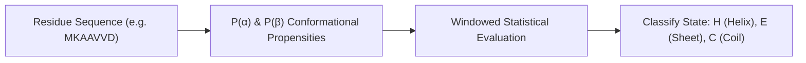

# Chou-Fasman Protein Secondary Structure Predictor Skill

Conformational parameter-based heuristic algorithm for classifying amino acid segments into alpha-helices, beta-sheets, or random coils.

## Features
- **100% Python Standard Library**: Canonical statistical tables.
- **Fast Sequence Scanning**: Linear-time scanning across peptide chains.
- **Rich Output Details**: Full numerical propensities per residue.
